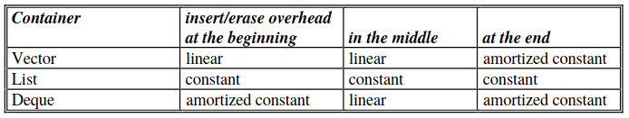
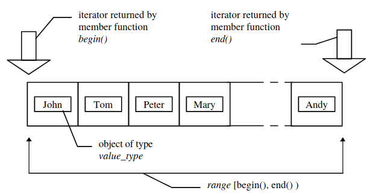

# STL Tutorial

In this tutorial we present examples from the [STL Tutorial](http://www.cmapx.polytechnique.fr/~benaych/stl-tutorial-Weidl.pdf). 

To run the code: 
```
g++ script_name.cpp -o script_name
./script_name
```
<b>Nice Classes.</b> For STL it’s wise to create classes that meet the requirements of <i>Nice Classes</i>. Forexample, Borland C++ expects an object to be stored in a container to have an assignment operatordefined. Additionally, if a container holds its objects in a particular order, a operator like the `operator<<` must be defined (the latter to fix a half-order).


The following table shows the <b>insert</b> and <b>erase</b> overheads of the containers <b>vector</b>, <b>list</b> and <b>deque</b>. Think of these overheads when choosing a container for solving a specific task.



For `stl_6.cpp` script, `v.begin()` returns an iterator to the first element in the vector. The iterator can be dereferenced and incremented like a C++ pointer. Please note, that `v.end()` doesn’t return an iterator that points to the last element in the vector - as now could be supposed - but <i>past</i> the last element (however, in the STL code such an iterator is named `last`). Accordingly it is called <i>past-the-end</i> iterator. A user is not supposed to dereference such an iterator, because the result would be undefined. The `while` loop checks if the `first` iterator is equal to the `last` iterator. If not, the iterator is dereferenced to get the object it is pointing to, then it is incremented. So, all vector elements are written to `cout`.


